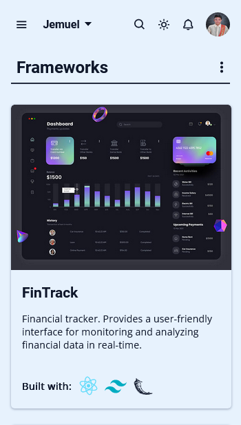
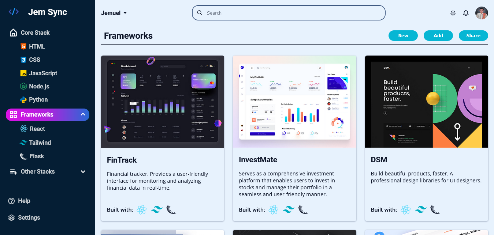

# THE ODIN PROJECT - STACK DASHBOARD

This is my solution to [The Odin Project Admin Dashboard](https://www.theodinproject.com/lessons/node-path-intermediate-html-and-css-admin-dashboard)

- [Overview](#overview)
  - [Links](#links)
  - [Screenshots](#screenshots)
- [My process](#my-process)
  - [Built with](#built-with)s
  - [Cool things I learned](#cool-things-i-learned)
- [Credits](#credits)

## Overview

### Links

- Live Site URL: [https://syjem.github.io/stack-dashboard/](https://syjem.github.io/stack-dashboard/)

### Screenshots
<p align="center">
  
</p>

<p align="center">
  
</p>

## My Process

### Built With

- Semantic HTML5 markup
- CSS custom properties
- CSS Grid
- Flex-box
- Mobile-first workflow
- JavaScript

### Cool things I learned

- Zoom images

``` js
img.forEach((pic) => {
    pic.addEventListener("click", () => {
      modal.style.display = "block";
      modalImage.src = pic.src;
      caption.textContent = pic.alt;
    });
  });

  close.addEventListener("click", () => {
    modal.style.display = "none";
  });
};
```

## Credits

- [The Odin Project](https://www.theodinproject.com/home)